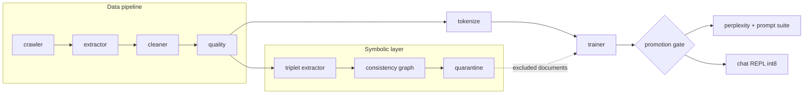

# Prometheus-NS

A neuro-symbolic language-modeling system that collects its own
training data from the open web, trains a compact decoder-only
transformer under a CPU-first compute budget, and improves itself in
discrete rounds. Every promotion is gated by measured perplexity on a
frozen holdout, a corpus diversity floor as a model-collapse guard,
and a symbolic consistency filter that quarantines contradicting
documents.

## Architecture



## Repository layout

```text
prometheus_ns/
  device.py        compute policy: device, threads, autocast (single source of truth)
  data/            crawler, extractor, cleaner, quality, reporter
  model/           config, blocks (RMSNorm/SwiGLU/RoPE/GQA), model, tokenizer, param count
  train/           streaming packed dataset, schedules, trainer with atomic checkpoints
  symbolic/        triplet extraction, consistency graph, output validation
  autoloop/        round orchestration, promotion gate, diversity guard
  eval/            held-out perplexity, domain prompt suite
scripts/           chat REPL, single-round runner, holdout freezing
tests/             structural contracts and unit tests
artifacts/         tokenizer (committed) and checkpoints (ignored)
```

## Quickstart

```bash
make setup            # venv + torch (CPU index) + pinned dependencies + spaCy model
make test             # structural contracts (Phase 0 verification)
make data             # crawl, extract, clean, report
python scripts/freeze_holdout.py --config config.yaml   # one-time holdout split
make tokenize         # BPE tokenizer for the active profile
make autofit          # preview the hardware probe and the profile it selects
make train PROFILE=nano TOKENS=5e6   # smoke pretraining run on CPU
make loop ROUNDS=1    # one self-improvement round
make eval             # held-out perplexity and prompt suite
make chat             # REPL with dynamic int8 quantization
```

## Usage targets

| Target | Purpose |
|--------|---------|
| `make data` | crawl, extract, clean, report |
| `make tokenize` | train the BPE tokenizer for the active profile |
| `make autofit` | preview the hardware probe and the auto-selected profile |
| `make train PROFILE=nano TOKENS=5e6` | smoke pretraining run on CPU |
| `make loop ROUNDS=1` | one self-improvement round |
| `make loop ROUNDS=2 AUTO_CONTINUE=1` | skip the human gate deliberately |
| `make eval` | held-out perplexity and prompt suite |
| `make chat QUANT=0` | REPL in fp32 (default is dynamic int8) |

## Data policy

- Sources: Wikipedia API, Project Gutenberg, arXiv API, and domains
  whose **robots.txt** allows our agent; the crawler re-checks
  **robots.txt** per URL.
- Identified crawler (`User-Agent: PrometheusNS-Research/0.1`), one
  request per second per domain, exponential backoff on failures.
- Extraction: trafilatura with a readability-lxml fallback. Cleaning:
  unicode repair, exact and MinHash near-duplicate removal, heuristic
  quality filters (symbol ratio, punctuation line ratio, stopword
  ratio). New documents are deduplicated against the historical index
  AND the frozen holdout to prevent test leakage.

## Holdout integrity

The evaluation holdout is split exactly once
(`scripts/freeze_holdout.py`). Its SHA-256 is recorded in
`config.yaml` under `loop.holdout_sha256` and is verified before every
promotion decision; a mismatch aborts the round instead of producing
a comparison. The holdout directory is committed to the repository as
part of the integrity anchor.

## Model profiles

| Profile | d_model | layers | heads | kv-heads | d_ff | max_seq | vocab |
|---------|---------|--------|-------|----------|------|---------|-------|
| nano    | 384     | 6      | 6     | 6        | 1024 | 256     | 8000  |
| small   | 768     | 12     | 12    | 12       | 2048 | 512     | 16000 |
| large   | 1024    | 16     | 16    | 8 (GQA)  | 4096 | 1024    | 16000 |

## Auto-fit: hardware-adaptive profiles

`config.yaml` ships with `model.profile: auto`. Before the tokenizer,
the packing step or the trainer build anything, the pipeline probes
the machine (`prometheus_ns/autofit.py`): effective CPU count, system
RAM, CUDA name and VRAM, MPS availability and free disk. The probe is
mapped to a profile deterministically:

| Detected hardware | Selected profile |
|-------------------|------------------|
| CUDA with >= 40 GB VRAM | `large` |
| CUDA with >= 16 GB VRAM | `small` |
| CUDA below 16 GB, or CPU-only | `nano` |

Besides the profile, `fit_memory` guards the training step: it
estimates the fp32 footprint (weights + gradients + AdamW moments +
activations) and halves the micro-batch — doubling gradient
accumulation so the effective batch never changes — whenever the
configured step would not fit `ram_headroom_cpu` of RAM (or
`ram_headroom_gpu` of VRAM). A 4 GB laptop and a 40 GB GPU therefore
train the same code without manual retuning.

Overrides, from strongest to weakest: `--profile NAME` (CLI, accepts
`auto`), `PROMETHEUS_NS_PROFILE=NAME` (environment), `model.profile`
(config). A concrete name always wins over detection and never probes
the hardware, so pinned runs stay reproducible. Thresholds are
tunable in the optional `autofit:` section of `config.yaml`; the
chosen profile, its reason and the memory-fit decision are logged as
the first row of `logs/metrics.jsonl`. The smoke-run configuration
(`config.smoke.yaml`) intentionally keeps `profile: nano` so the
recorded evidence stays reproducible on any machine.

## Measured metrics

No estimated numbers are reported in this project; the table below is
populated only from executed runs. The smoke values were measured on a
2-core / 3 GB CPU container (the reference environment of the
specification assumes 8-16 cores); Wikipedia API access was blocked
from that network (HTTP 403), so the smoke crawl covered Project
Gutenberg and arXiv only. The reduced-scale configuration used for the
smoke run is preserved in `config.smoke.yaml`; `config.yaml` keeps the
contracted defaults for real runs.

| Metric | Value | Source |
|--------|-------|--------|
| nano parameter count | 13,693,824 | `python -m prometheus_ns.model.count_params --profile nano` |
| small parameter count (analytic) | 97,241,856 | `python -m prometheus_ns.model.count_params --profile small` |
| large parameter count (analytic) | 268,076,032 | `python -m prometheus_ns.model.count_params --profile large` |
| training throughput (CPU smoke, 2 cores) | 1,504.8 tokens/s | `logs/metrics.jsonl` (500k-token run) |
| smoke-run val perplexity | 2430.10 -> 1367.43 (500k tokens, 31 steps) | trainer stdout + `logs/metrics.jsonl` |
| holdout perplexity fp32 | 2,928.72 | `logs/eval_ppl.json` |
| holdout perplexity int8 (dynamic) | 2,927.76 (-0.03% vs fp32) | `logs/eval_ppl.json` |
| tokenizer fertility (nano, 8k vocab) | 1.4114 tokens/word | `artifacts/tokenizer/report.json` |
| round 1 promotion | promoted: val_ppl 2,276.62, diversity 0.4720 | `docs/promotion_log.md` |
| smoke corpus (16 pages crawled, 2 sources) | 22 docs kept, 1.174 MB | `docs/data_report.json` |

## GPU migration

Documented in `docs/gpu_migration.md` (phase 8). The switch is
configuration-only: `model.profile`, batch sizes and bf16 flags live
in `config.yaml`, and all device logic lives in `device.py`.

## Status

| Phase | Scope |
|-------|-------|
| 0 | skeleton, contracts, environment |
| 1 | autonomous data pipeline |
| 2 | tokenizer and model |
| 3 | CPU pretraining |
| 4 | symbolic module |
| 5 | self-improvement loop |
| 6 | evaluation and inference |
| 7 | final documentation |
| 8 | GPU migration (documented, not executed) |

## Limitations

- The nano model is a ~14M parameter system trained on a small corpus:
  generations are often incoherent and factual claims are unreliable.
  The prompt suite records outputs as observed, without corrections.
- int8 dynamic quantization on a model this size can degrade
  perplexity measurably; the measured delta is reported by
  `eval/perplexity.py --int8` rather than assumed below any threshold.
- Packed windows mix documents under plain causal attention; the
  document-boundary flags enable block-diagonal masking, which the
  trainer uses, but the eval path uses plain causal windows.
- The symbolic layer uses curated disjunction lists; polysemous
  subjects ("jaguar" the animal vs the car) are only partially
  disambiguated by entity normalization, so recall of true
  contradictions is bounded by the extractor's pattern coverage.
- Checkpoint writes rely on POSIX atomic rename semantics; run the
  project on Linux/WSL2 (Windows locks `os.replace` targets held open
  by another process).

## Resumen en español

Prometheus-NS es un sistema neuro-simbólico que recolecta sus propios
datos de entrenamiento desde la web (Wikipedia, Project Gutenberg,
arXiv), limpia el corpus con deduplicación exacta y MinHash, entrena
un transformer decoder-only compacto en CPU y se auto-mejora en
rondas medibles. Cada ronda pasa por una compuerta de promoción con
tres reglas: (1) la perplejidad sobre el holdout congelado debe bajar
al menos 1% relativo, (2) la diversidad del corpus no debe caer más
de 20% frente a la ronda previa y (3) el hash SHA-256 del holdout
debe coincidir con el ancla registrada en `config.yaml`; cualquier
discrepancia aborta la ronda. Los documentos contradictorios
detectados por el grafo simbólico van a cuarentena y se excluyen del
pretraining siguiente, sin borrarse, para mantener la auditabilidad.

Comandos equivalentes a la guía rápida: `make setup`, `make test`,
`make data`, `python scripts/freeze_holdout.py --config config.yaml`,
`make tokenize`, `make autofit`, `make train PROFILE=nano TOKENS=5e6`,
`make loop ROUNDS=1`, `make eval` y `make chat`.

Auto-ajuste de perfil: `config.yaml` trae `model.profile: auto`; el
pipeline sondea la máquina (núcleos efectivos, RAM, VRAM CUDA, MPS,
disco) y elige el perfil por reglas deterministas: CUDA con >= 40 GB
selecciona `large`, >= 16 GB selecciona `small`, y sin acelerador se
entrena `nano` en fp32. Además, el paso de entrenamiento se ajusta a
la memoria disponible reduciendo el micro-batch y duplicando la
acumulación de gradientes (el lote efectivo no cambia), de modo que el
mismo código corre desde una laptop de 4 GB hasta una GPU de 40 GB sin
retoques manuales. La precedencia es: `--profile` > variable de
entorno `PROMETHEUS_NS_PROFILE` > `model.profile`; un nombre concreto
nunca sondea el hardware, y los umbrales se ajustan en la sección
`autofit:` de `config.yaml`.

## PROMETHEUS-V2

Capa de neurotopología (análisis topológico de datos) sobre el ciclo de
auto-mejora: la topología de los espacios internos del modelo y del grafo
simbólico gana DERECHO DE VETO sobre la promoción. El gate heredado no se
modifica; el gate V2 es compuesto:

```mermaid
flowchart TD
    A[candidato entrenado] --> B[eval NS: ppl holdout congelado + diversidad]
    A --> C[topo-extract: diagramas de persistencia\nactivaciones probe, geometria congelada]
    A --> D[topo-graph: censo R3a triangulos dirigidos\n+ R3b Rips observacion]
    B --> E{decide_promotion NS\n[inmutable]}
    C --> F{decide_topo_veto\n[ancla, no editar]}
    D --> F
    E -->|promote ∧ no veto| G[PROMOCION]
    E -->|promote ∧ veto| H[CASO ESTRELLA:\nla topologia bloquea]
    E -->|reject| I[se mantiene champion]
```

Tres reglas cierran el veto (ancla `prometheus_ns/topo/promotion_topology.py`,
bottleneck exacto por asignación rectangular con extremos requeridos — el
atajo de suma-mínima está matematicamente refutado en
`tests/test_topo_promotion.py`):

- **R1 churn estructural**: distancia bottleneck (H0/H1 sobre el cloud de
  activaciones concatenado, capas 2 y 5) > 0.15 sin ganancia relativa de
  ppl >= 0.02 que la excuse.
- **R2 colapso representacional**: betti0@eps=0.3 < 0.5 x el MÍNIMO
  HISTÓRICO (D3) de betti0.
- **R3 crecimiento ciclico simbólico (R3a)**: censo EXACTO de triángulos
  dirigidos con confianza >= 0.6 sobre el top-800 de entidades > 1.25 x el
  del champion. R3b (H1-Rips sobre d(u,v)=1-conf) se registra, jamás vetoa:
  bajo esa filtración los ciclos de alta confianza se cierran temprano.

### Calibración del sensor (A3)

Mismo checkpoint, 5 seeds de subsample -> p95 del self-bottleneck =
**0.0963 < churn_bottleneck = 0.15**: el umbral congelado supera el piso
de ruido del sensor (`artifacts/topo/self_noise.json`).

### Protocolo de divergencia deliberada (el experimento central)

3 rondas normales (N1-N3, ventana de calibración) -> congelación
verificada por `config_sha256` (B1) -> 3 rondas de estrés. Integridad
mecánica (V1-V5) en `scripts/divergence_report.py`; tasas con intervalos
Wilson exactos; framing de case study.

| ronda | tipo | NS | veto | divergencia | daño (B5, externo) |
|---|---|---|---|---|---|
| 1 | baseline | promovida | - | - | - |
| 2-3 | normal | promovidas | no | no | - |
| 4 | dup_flood | promovida | no | no | - |
| 5 | contradiction_flood | promovida (ppl 50.4) | **SI (R3: 1483 > 1275)** | **SI** | **damage evidence** |
| 6 | lr_spike | rechazada (ppl 2376.8) | si (R1+R2: redundante) | no | - |

**Resultado medido**: el veto topológico disparó donde las métricas
superficiales aprobaban exactamente en el modo diseñado para ello
(contradicción taxonómica plantada: +46% triángulos dirigidos), y la
clasificación externa al gate confirma daño real. El dup_flood mejora la
ppl superficial (memorización) SIN daño estructural detectable — el veto
no dispara: diferencia de criterios documentada, no falsa alarma. El
lr_spike es detectado por ambos gates (ppl Y topología, redundancia
honesta). Tasas: normal 0/2, estrés 1/3, Wilson 95% [0.061, 0.792].

### Notebooks TDA

`05_model_topology.ipynb` (diagramas por capa/ronda, betti0 con mínimo
histórico, self-noise), `06_graph_topology.ipynb` (censo R3a con aristas,
R3b con lectura honesta, cruce con cuarentena NS),
`07_divergence_study.ipynb` (tabla de divergencia con Wilson, ppl vs
bottleneck, caso estrella). Leen SOLO los JSON estructurados
(`logs/topo.jsonl`, `logs/promotion_decisions.jsonl`, E1).

### Límites honestos

- n pequeño: los intervalos Wilson SON el resultado; nada de tasas
  poblacionales.
- Umbrales calibrados en un modelo, una seed, una política geométrica
  (PCA 32 + normalización, congelada en Fase 0-V2).
- R3b depende del top-K; la topología DESCRIBE geometría, no causa
  calidad; divergencia sin veredicto de daño no prueba utilidad del veto.
- El champion fue regenerado tras pérdida de checkpoints del sandbox
  (Fase -1, pipeline NS determinista documentado en el historial); el
  holdout permaneció bit-exacto (`loop.holdout_sha256`).
